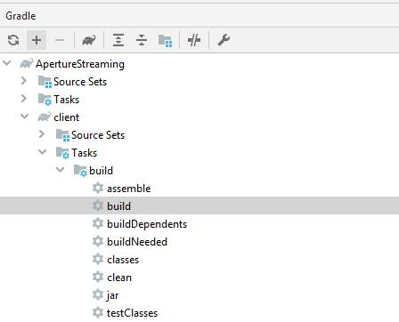
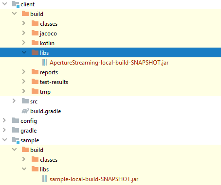
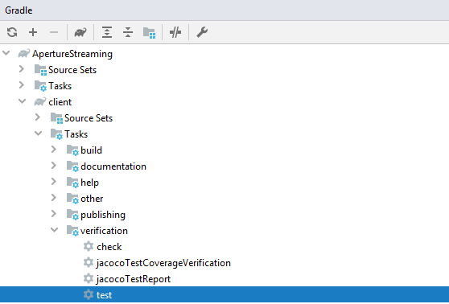
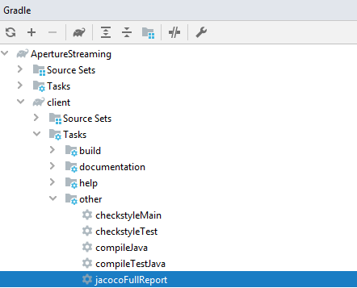
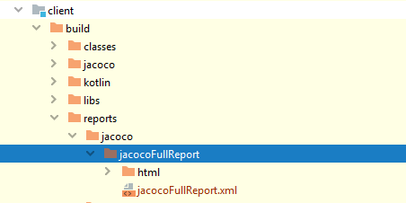

# Aperture Streaming SDK

This project contains Software Development Kit (SDK) source code and supporting modules for the [Aperture Validation Streaming Endpoint](https://api.experianaperture.io/validation/streaming). The SDK can be added as a dependency to any application by downloading the SDK jar from the libs folder. For an example of it in action you should note that it is utilized by the validation custom steps in Aperture Data Studio v2.0.

## Table of contents

<!-- TOC -->

- [Getting Started](#getting-started)
- [Project Requirement](#project-requirement)
- [Project Setup](#project-setup)
- [Integration](#integration)
  * [Request Validation](#request-validation)
  * [Options Configuration](#options-configuration)
  * [Exception Handling](#exception-handling)
    + [onRequestFailure](#onrequestfailure)
      - [Sample Code](#sample-code)
    + [onConnectionFailure](#onconnectionfailure)
      - [Sample Code](#sample-code-1)
  * [Retry Configuration](#retry-configuration)
- [Build](#build)
  * [Checkstyle](#checkstyle)
- [Test](#test)
  * [Generating Test Report](#generating-test-report)

<!-- /TOC -->

## Getting Started

To ensure a successful streaming connection, you will need a valid Token to use Experian Validation products. You can find out more about Tokens [here](https://www.edq.com/documentation/self-service-portal/#tokens).

## Project Requirement

Make sure the application/client have the following installed:

* JDK8.
* Git. For Windows user you may grab one from [here](https://gitforwindows.org/).
* Gradle. You can either use the bundled gradle wrapper by executing `gradlew` (_*nix_) or `gradlew.bat` (_Windows_) or 
  [install Gradle on your own](https://gradle.org/releases/).
* [Intellij IDEA Community](https://www.jetbrains.com/idea/download/). 

## Project Setup

In order to set up the project in IntelliJ, select `File > New > Project from Version Control... > Git`. Copy the git HTTPS URL into the `Clone Repository` field in Intellij. After the repository has been cloned, IntelliJ will show an "Gradle projects need to be imported" message. Click Import changes.

## Integration

This project has the sample code that shows how to integrate Aperture Streaming SDK. Entry point for sample code is `Streaming.java` under `sample` module. This sample code demonstrates how to open connection, send Email/Phone/Enrichment streaming requests, receive the response and close the connection.

### Request Validation

Aperture Streaming SDK validates every request that comes in. If the any of the request parameters value is `Empty/Null`, it throws `IllegalArgumentException`. However for `referenceId` parameter, Aperture Streaming SDK has extra validation where it should not be `WhiteSpace/NonAlphaNumeric`

### Options Configuration

Aperture Streaming SDK has `<Request>Options` for every request. If the consumer of SDK does not provide any options, the SDK will use default values based as per below:

* EmailValidationOptions   

    * AddMetadata = true
    * Timeout = 3s 
         
* PhoneValidationOptions

    * AddMetadata = true
    * OutputFormat = E164
    * CacheValueDays = 7
    * Timeout = 15s
        
* EnrichmentOptions

    * AddMetadata = true
    * MatchRule = null
    * LinkageRule = null
    
### Exception Handling

Below are the exceptions raised from Aperture Streaming SDK. Consumers of SDK are advised to catch and handle these exceptions at their end.

* RateLimitException - Raise this exception with the message `429 (Too Many Request) Your account has been blocked for one minute as the rate at which you are submitting requests is too high. Wait one minute and reduce the rate you are submitting requests.`

* ConnectionException - Raise this exception with message as below
 
    * Your connection disconnected. Please restart the job from latest item successfully submitted.
    
    * 404 (Not Found) Failed to establish the connection. This URL is not valid. Please check you have entered a valid Hub URL.

Besides, they are also advised to subscribe to `onRequestFailure` and `onConnectionFailure` events in order to handle more errors.

#### onRequestFailure 

Below are the errors raised when there is a failure in processing the request.

* 401 (Unauthorized) The request is not authorized. Check you have entered a valid Token from a deployment that contains an active product license.

* 503 (Service Unavailable) The hub is currently busy or down for maintenance. Check status.edq.com or wait 5 minutes and try again.

* 500 (Internal Server Error) An unhandled error has occurred. 

Below is the sample piece of code showing how to subscribe to `onRequestFailure` event. `FailRequestResponse` object will have the error cause and the referenceId of the failed request. 

##### Sample Code
    client.onRequestFailure().subscribe(failRequestResponse -> {
            final String message = String.format("Error sending a request. Method name: %s; Reference Id: %s; Error message: %s",
                    failRequestResponse.getMethod().getValue(),
                    failRequestResponse.getReferenceId(),
                    failRequestResponse.getError().getValue());
            System.out.println(message);
        });

#### onConnectionFailure

Below are the errors raised when there is a failure on connection to Aperture Streaming.

* 401 (Unauthorized) Failed to establish the connection. This token is not authorized. Check you have entered a valid Token from a deployment that contains an active product license.

* 403 (Forbidden) Failed to establish the connection. This token may have been exceeded the maximum connection limit. Please check all the active connections.

Below is the sample piece of code showing how to subscribe to `onConnectionFailure` event. `ConnectionFailResponse` object will have the necessary information of all the outstanding requests (requests with no response). 

##### Sample Code
    client.onConnectionFailure().subscribe(connectionFailResponse -> {
            System.out.println(connectionFailResponse.getError().getValue());
            connectionFailResponse.getFailRequests().forEach(x -> {
                final String message = String.format("Error sending a request when reconnecting to server. Method name: %s; Reference Id: %s; Error message: %s",
                        x.getMethod().getValue(),
                        x.getReferenceId(),
                        x.getError().getValue());
                System.out.println(message);
            });
        });

### Retry Configuration

During request processing, if any disconnection happens to Aperture streaming, the SDK retries based on the configuration defined in `RetryOptions`. Below are the parameters.

* EnableAutoReconnect - The configuration to enable or disable auto reconnect.

* ReconnectCount - The count of retry connection to Aperture Streaming. The value should be greater than or equal to 1.

* RestartIntervalMilliSeconds - The interval to restart connection to Aperture Streaming. The value should be should be greater than or equal to 1.

If consumer of Aperture Streaming SDK does not specify the configuration, below are the default values. 
        
        EnableAutoReconnect = true        
        ReconnectCount = 30        
        RestartIntervalMilliSeconds = 60000
        
If the connection to Aperture Streaming is not established after retry, Aperture Streaming SDK throws below error under [onConnectionFailure](#sample-code-1) event.

   * Failed to re-establish the connection. Please restart the job from latest item successfully submitted.    

## Build

running `gradle build` from terminal or Intellij will trigger the build for all sub-projects.

Each project will generate their respective build binary inside `<module-name>/build/libs/` folder. 

The version of the build will be generated based on the value of semantiVersion defined in gradle.properties.

### Checkstyle

Checkstyle will be run on every `gradle build`. Any checkstyle **ERROR**-level violation will fail the build. 

* [Checkstyle rules configuration](java/config/checkstyle/checkstyle.xml)
* [Checkstyle suppression file](java/config/checkstyle/suppressions.xml)

## Test 

`gradle build` will implicitly trigger all of JUnit test classes in all of the sub-projects. Any failing test will fail the build.

Run `gradle test` to trigger only the JUnit test classes.

  
### Generating Test Report

We are utilizing Jacoco to generate code coverage report. Run `gradle jacocoFullReport` to generate and consolidate test coverage for all subprojects.

The report will be generated on the root project's `build` folder:

